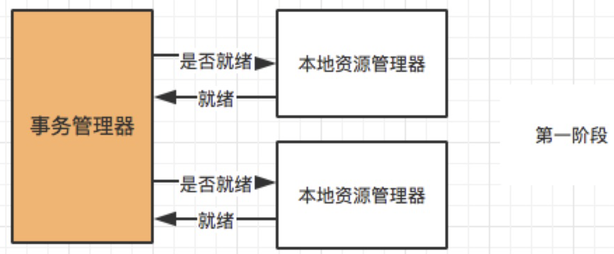
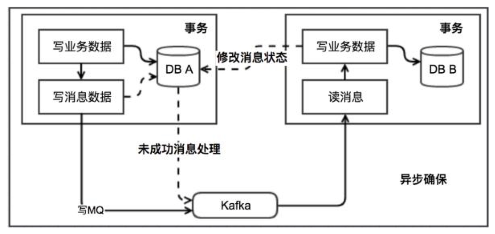
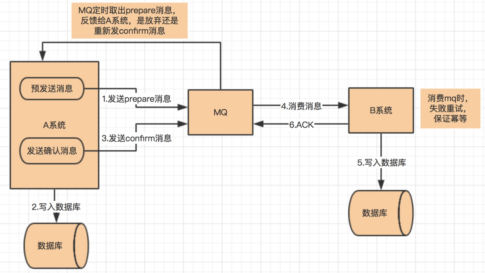

# 分布式事务

https://www.cnblogs.com/crazymakercircle/p/14375424.html

分布式事务指：事务的参与者、支持事务的服务器、资源服务器以及事务管理器分别位于不同的分布式系统的不同节点之上

## 数据一致性

### 强一致性

任何一次读都能读到某个数据的最近一次写的数据。系统中的所有进程，看到的操作顺序，都和全局时钟下的顺序一致。简言之，在任意时刻，所有节点中的数据是一样的。

### 弱一致性

数据更新后，如果能容忍后续的访问只能访问到部分或者全部访问不到，则是弱一致性。

### 最终一致性

不保证在任意时刻任意节点上的同一份数据都是相同的，但是随着时间的迁移，不同节点上的同一份数据总是在向趋同的方向变化。简单说，就是在一段时间后，节点间的数据会最终达到一致状态。

## 2PC 两阶段提交 XA

强一致性？

存在一个负责协调各个本地资源管理器的事务管理器，本地资源管理器一般是由数据库实现，事务管理器在第一阶段的时候询问各个资源管理器是否都就绪？如果收到每个资源的回复都是 yes，则在第二阶段提交事务，如果其中任意一个资源的回复是 no, 则回滚事务。

实现步骤：

第一阶段（prepare）：事务管理器向所有本地资源管理器发起请求，询问是否是 ready 状态，所有参与者都将本事务能否成功的信息反馈发给协调者；
第二阶段 (commit/rollback)：事务管理器根据所有本地资源管理器的反馈，通知所有本地资源管理器，步调一致地在所有分支上提交或者回滚。

**存在的问题：**

同步阻塞：事务参与者如果使用公共资源，则存在资源阻塞情况

单点故障：事务协调者的单点问题

数据不一致：如果在二步发送commit，部分在途中丢失，那么只有部分节点提交

**解决方案：**

ack机制 + 重试机制+超时问询

## TCC

强一致性？

跟钱相关的，常用，需要保持一个业务的强一致性

TCC(Try Confirm Cancel)
**Try** 阶段：尝试执行，完成所有业务检查（一致性）, 预留必须业务资源（准隔离性）
**Confirm** 阶段：确认执行真正执行业务，不作任何业务检查，只使用 Try 阶段预留的业务资源，Confirm 操作满足幂等性。要求具备幂等设计，Confirm 失败后需要进行重试。
**Cancel** 阶段：取消执行，释放 Try 阶段预留的业务资源 Cancel 操作满足幂等性 Cancel 阶段的异常和 Confirm 阶段异常处理方案基本上一致。

## 本地消息表

消息的最终一致性

1. 当系统 A 被其他系统调用发生数据库表更操作，首先会更新数据库的业务表，其次会往相同数据库的消息表中插入一条数据，两个操作发生在同一个事务中
2. 系统 A 的脚本定期轮询本地消息往 mq 中写入一条消息（可以使用守护线程+分布式锁？），如果消息发送失败会进行重试
3. 系统 B 消费 mq 中的消息，并处理业务逻辑。如果本地事务处理失败，会在继续消费 mq 中的消息进行重试，如果业务上的失败，可以通知系统 A 进行回滚操作

本地消息表实现的条件：

1. 消费者与生成者的接口都要支持幂等
2. 生产者需要额外的创建消息表
3. 需要提供补偿逻辑，如果消费者业务失败，需要生产者支持回滚操作

容错机制：

1. 步骤 1 失败时，事务直接回滚
2. 步骤 2、3 写 mq 与消费 mq 失败会进行重试
3. 步骤 3 业务失败系统 B 向系统 A 发起事务回滚操作

此方案的核心是将需要分布式处理的任务通过消息日志的方式来异步执行。消息日志可以存储到本地文本、数据库或消息队列，再通过业务规则自动或人工发起重试。人工重试更多的是应用于支付场景，通过对账系统对事后问题的处理。

## 可靠消息最终一致性

需要结合消息队列，目前支持的只有RocketMq？

1. A 系统先向 mq 发送一条 prepare 消息，如果 prepare 消息发送失败，则直接取消操作
2. 如果消息发送成功，则执行本地事务
3. 如果本地事务执行成功，则想 mq 发送一条 confirm 消息，如果发送失败，则发送回滚消息
4. B 系统定期消费 mq 中的 confirm 消息，执行本地事务，并发送 ack 消息。如果 B 系统中的本地事务失败，会一直不断重试，如果是业务失败，会向 A 系统发起回滚请求

5.mq 会定期轮询所有 prepared 消息调用系统 A 提供的接口查询消息的处理情况，如果该 prepare 消息本地事务处理成功，则重新发送 confirm 消息，否则直接回滚该消息

该方案与本地消息最大的不同是去掉了本地消息表，其次本地消息表依赖消息表重试写入 mq 这一步由本方案中的轮询 prepare 消息状态来重试或者回滚该消息替代。其实现条件与余容错方案基本一致。目前市面上实现该方案的只有阿里的 RocketMq。

## 最大努力通知方案

这个方案的大致意思就是：

（1）系统 A 本地事务执行完之后，发送个消息到 MQ；

（2）这里会有个专门消费 MQ 的最大努力通知服务，这个服务会消费 MQ 然后写入数据库中记录下来，或者是放入个内存队列也可以，接着调用系统 B 的接口；（类似于实现一个事件中心专门做这个事情，但是消费是我们自己去监听需要的事件）

（3）要是系统 B 执行成功就 ok 了；要是系统 B 执行失败了，那么最大努力通知服务就定时尝试重新调用系统 B，反复 N 次，最后还是不行就放弃。

