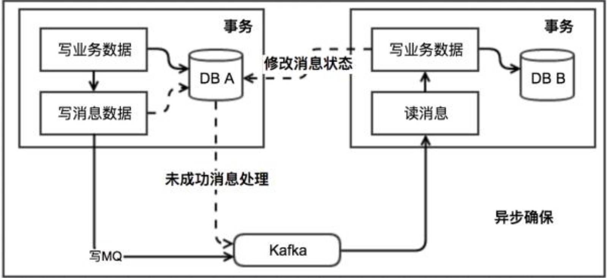
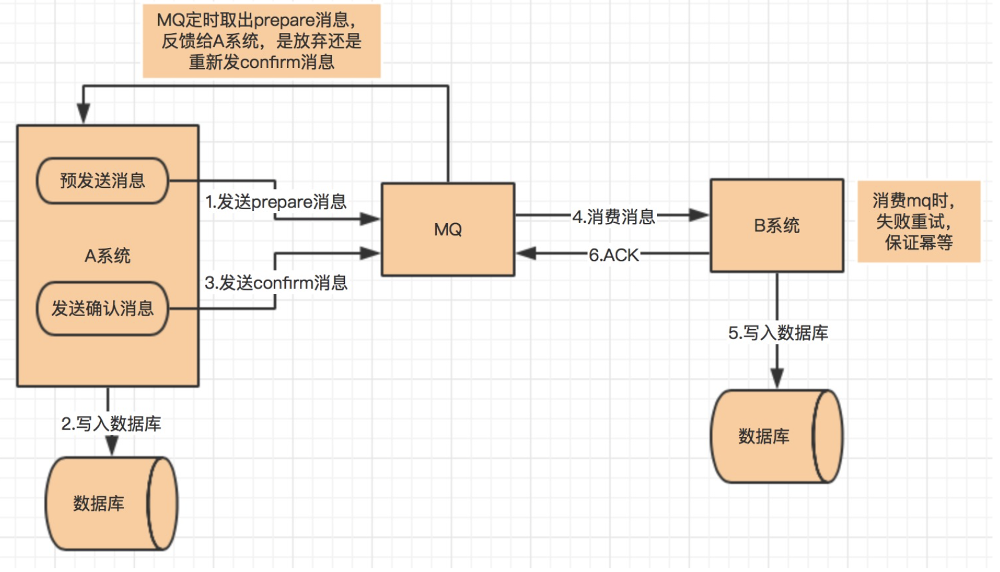

# 分布式事务

https://xiaomi-info.github.io/2020/01/02/distributed-transaction/

## 2PC

强一致性？

## 3PC

## TCC

强一致性？

## 本地消息表

消息的最终一致性

1. 当系统 A 被其他系统调用发生数据库表更操作，首先会更新数据库的业务表，其次会往相同数据库的消息表中插入一条数据，两个操作发生在同一个事务中
2. 系统 A 的脚本定期轮询本地消息往 mq 中写入一条消息（可以使用守护线程+分布式锁？），如果消息发送失败会进行重试
3. 系统 B 消费 mq 中的消息，并处理业务逻辑。如果本地事务处理失败，会在继续消费 mq 中的消息进行重试，如果业务上的失败，可以通知系统 A 进行回滚操作

本地消息表实现的条件：

1. 消费者与生成者的接口都要支持幂等
2. 生产者需要额外的创建消息表
3. 需要提供补偿逻辑，如果消费者业务失败，需要生产者支持回滚操作

容错机制：

1. 步骤 1 失败时，事务直接回滚
2. 步骤 2、3 写 mq 与消费 mq 失败会进行重试
3. 步骤 3 业务失败系统 B 向系统 A 发起事务回滚操作

此方案的核心是将需要分布式处理的任务通过消息日志的方式来异步执行。消息日志可以存储到本地文本、数据库或消息队列，再通过业务规则自动或人工发起重试。人工重试更多的是应用于支付场景，通过对账系统对事后问题的处理。

## 可靠消息最终一致性

需要结合消息队列，目前支持的只有RocketMq？

1. A 系统先向 mq 发送一条 prepare 消息，如果 prepare 消息发送失败，则直接取消操作
2. 如果消息发送成功，则执行本地事务
3. 如果本地事务执行成功，则想 mq 发送一条 confirm 消息，如果发送失败，则发送回滚消息
4. B 系统定期消费 mq 中的 confirm 消息，执行本地事务，并发送 ack 消息。如果 B 系统中的本地事务失败，会一直不断重试，如果是业务失败，会向 A 系统发起回滚请求

5.mq 会定期轮询所有 prepared 消息调用系统 A 提供的接口查询消息的处理情况，如果该 prepare 消息本地事务处理成功，则重新发送 confirm 消息，否则直接回滚该消息

该方案与本地消息最大的不同是去掉了本地消息表，其次本地消息表依赖消息表重试写入 mq 这一步由本方案中的轮询 prepare 消息状态来重试或者回滚该消息替代。其实现条件与余容错方案基本一致。目前市面上实现该方案的只有阿里的 RocketMq。