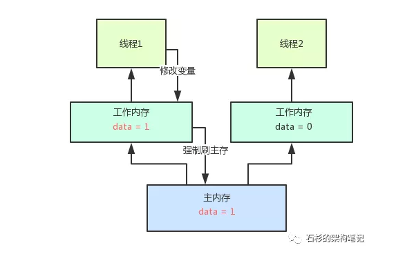

## volatile到底是什么

1、 保证变量的可见性（不保证原子性，需要和synchronized同步使用保证原子性）

涉及到java内存模型（JMM），结合起来一起回答。

**Java虚拟机规范试图定义一种Java内存模型（JMM）,来屏蔽掉各种硬件和操作系统的内存访问差异，让Java程序在各种平台上都能达到一致的内存访问效果**

每个线程都有一个工作内存一一对应，线程加载数据的时候通过CPU指令，read，load，write等进行读取。使用


一旦data变量定义的时候前面加了volatile来修饰的话，那么线程1只要修改data变量的值，**就会在修改完自己本地工作内存的data变量值之后，强制将这个data变量最新的值刷回主内存**，必须让主内存里的data变量值立马变成最新的值！



如果其他线程的工作内存有这个变量的副本，那么直接强制失效，下次读取时必须从主内存中读取，保存变量的一致性。


2、禁止指令重排序

CPU和编译器为了提升程序执行的效率，会按照一定的规则允许进行指令优化。但代码逻辑之间是存在一定的先后顺序，并发执行时按照不同的执行逻辑会得到不同的结果。

举个例说明多线程中可能出现的重排现象：

```
class ReOrderDemo {
    int a = 0;
    boolean flag = false;
 
    public void write() {
        a = 1;                   //1
        flag = true;             //2
    }
     
    public void read() {
        if (flag) {                //3
            int i =  a * a;        //4
            ……
        }
    }
}复制代码
```

在上面的代码中，单线程执行时，read方法能够获得flag的值进行判断，获得预期结果。但在多线程的情况下就可能出现不同的结果。比如，当线程A进行write操作时，由于指令重排，write方法中的代码执行顺序可能会变成下面这样：

```
flag = true;             //2
a = 1;                   //1复制代码
```

也就是说可能会先对flag赋值，然后再对a赋值。这在单线程中并不影响最终输出的结果。

但如果与此同时，B线程在调用read方法，那么就有可能出现flag为true但a还是0，这时进入第4步操作的结果就为0，而不是预期的1了


### 能够保证原子性？

volatile不能保证原子性，它只是对单个volatile变量的读/写具有原子性，但是对于类似i++这样的复合操作就无法保证了。

如下代码，从直观上来讲，感觉输出结果为10000，但实际上并不能保证，就是因为inc++操作属于复合操作。

```
public class Test {
    public volatile int inc = 0;
 
    public void increase() {
        inc++;
    }
 
    public static void main(String[] args) {
        final Test test = new Test();
        for(int i=0;i<10;i++){
            new Thread(){
                public void run() {
                    for(int j=0;j<1000;j++)
                        test.increase();
                };
            }.start();
        }
 
        while(Thread.activeCount()>1)  //保证前面的线程都执行完
            Thread.yield();
        System.out.println(test.inc);
    }复制代码
```

假设线程A，读取了inc的值为10，然被阻塞，因未对变量进行修改，未触发volatile规则。线程B此时也读取inc的值，主存里inc的值依旧为10，做自增，然后立刻写回主存，值为11。此时线程A执行，由于工作内存里保存的是10，所以继续做自增，再写回主存，11又被写了一遍。所以虽然两个线程执行了两次increase()，结果却只加了一次。

有人说，volatile不是会使缓存行无效的吗？但是这里线程A读取之后并没有修改inc值，线程B读取时依旧是10。又有人说，线程B将11写回主存，不会把线程A的缓存行设为无效吗？只有在做读取操作时，发现自己缓存行无效，才会去读主存的值，而线程A的读取操作在线程B写入之前已经做过了，所以这里线程A只能继续做自增了。


### Volatile 还有其他用处吗？

比如单例模式的实现，使用双重检验锁，用于禁止指令重排序

```java
class Singleton{
    private volatile static Singleton instance = null;
 
    private Singleton() {}
 
    public static Singleton getInstance() {
    	// 第一次判断避免大量线程争抢锁
        if(instance==null) { // 1
            synchronized (Singleton.class) {
            	// 拿到锁之后在判断是否初始化
                if(instance==null)
                    instance = new Singleton(); // 2
            }
        }
        return instance;
    }
}

```

这是一种懒汉的单例模式，使用时才创建对象，而且为了避免初始化操作的指令重排序，给instance加上了volatile。

为什么用了synchronized还要用volatile？具体来说就是synchronized虽然保证了原子性，但却没有保证指令重排序的正确性，会出现A线程执行初始化，但可能因为构造函数里面的操作太多了，所以A线程的instance实例还没有造出来，但已经被赋值了（即代码中2操作，先分配内存空间后构建对象）。

而B线程这时过来了（代码1操作，发现instance不为null），错以为instance已经被实例化出来，一用才发现instance尚未被初始化。要知道我们的线程虽然可以保证原子性，但程序可能是在多核CPU上执行。

**创建对象的时候可以分为多个步骤**

- 分配内存
- 创建对象
- 将内存地址指向创建的对象

**如果进行了指令重拍导致创建了对象还没有分配内存地址，那么就会出现问题。**


### 与synchronized有什么区别吗？

- volatile本质是在告诉JVM当前变量在寄存器（工作内存）中的值是不确定的，需要从主存中读取；synchronized则是锁定当前变量，只有当前线程可以访问该变量，其他线程被阻塞住。
- 作用的粒度不同，volatile仅能使用在变量级别；synchronized则可以使用在变量、方法和类级别的
- volatile仅能实现变量的修改可见性，不能保证原子性；而synchronized则可以保证变量的修改可见性和原子性
- volatile不会造成线程的阻塞；synchronized可能会造成线程的阻塞
- volatile标记的变量不会被编译器优化；synchronized标记的变量可以被编译器优化

### Volatile实现原理

