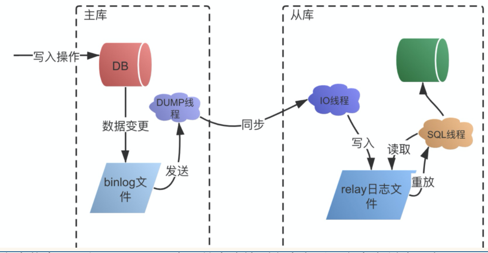
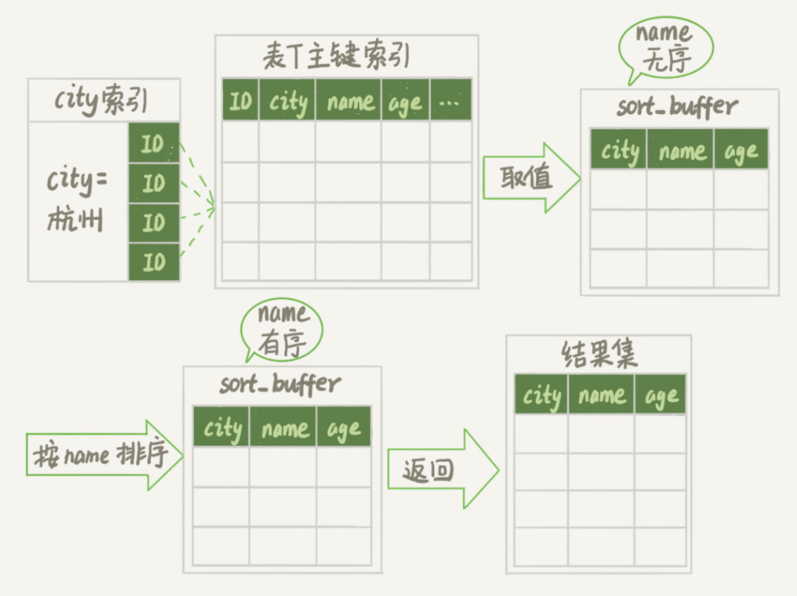
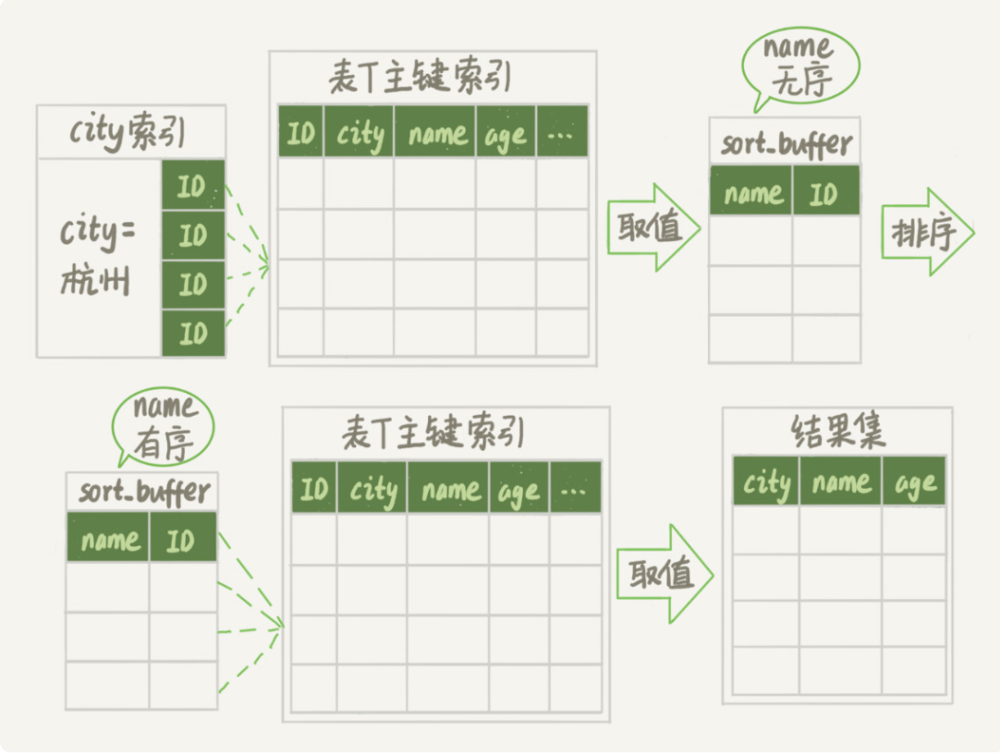

# Mysql

## **Innodb和MySIAM**区别

- MyISAM类型不支持事务处理等高级处理，而InnoDB类型支持。MyISAM类型的表强调的是性能，其执行数度比InnoDB类型更快，但是不提供事务支持，而InnoDB提供事务支持以及外部键等高级数据库功能
- InnoDB 中不保存表的具体行数，每次select count(*)会扫描整个表
- DELETE FROM table时，InnoDB不会重新建立表，而是一行一行的删除

## mysql隔离级别

事务具有四个特征：原子性（ Atomicity ）、一致性（ Consistency ）、隔离性（ Isolation ）和持续性（ Durability ）。这四个特性简称为 ACID 特性。

- 原子性。事务是数据库的逻辑工作单位，事务中包含的各操作要么都做，要么都不做
- 一致性。事 务执行的结果必须是使数据库从一个一致性状态变到另一个一致性状态。因此当数据库只包含成功事务提交的结果时，就说数据库处于一致性状态。如果数据库系统 运行中发生故障，有些事务尚未完成就被迫中断，这些未完成事务对数据库所做的修改有一部分已写入物理数据库，这时数据库就处于一种不正确的状态，或者说是 不一致的状态。
- 隔离性。一个事务的执行不能其它事务干扰。即一个事务内部的操作及使用的数据对其它并发事务是隔离的，并发执行的各个事务之间不能互相干扰。
- 持续性。也称永久性，指一个事务一旦提交，它对数据库中的数据的改变就应该是永久性的。接下来的其它操作或故障不应该对其执行结果有任何影响。

### Read Uncommitted（读取未提交内容）

在该隔离级别，所有事务都可以看到其他未提交事务的执行结果。本隔离级别很少用于实际应用，因为它的性能也不比其他级别好多少。读取未提交的数据，也被称之为脏读（Dirty Read）。

### Read Committed（读取提交内容）

这是大多数数据库系统的默认隔离级别（但不是MySQL默认的）。它满足了隔离的简单定义：一个事务只能看见已经提交事务所做的改变。这种隔离级别 也支持所谓的不可重复读（Nonrepeatable Read），因为同一事务的其他实例在该实例处理其间可能会有新的commit，所以同一select可能返回不同结果。

### Repeatable Read（可重读）

这是MySQL的默认事务隔离级别，它确保同一事务的多个实例在并发读取数据时，会看到同样的数据行。不过理论上，这会导致另一个棘手的问题：幻读 （Phantom Read）。简单的说，幻读指当用户读取某一范围的数据行时，另一个事务又在该范围内插入了新行，当用户再读取该范围的数据行时，会发现有新的“幻影” 行。InnoDB和Falcon存储引擎通过多版本并发控制（MVCC，Multiversion Concurrency Control）机制解决了该问题。

**幻读仅专指“新插入的行”。**指的是一个事务在前后两次查询同一个范围的时候，后一次查询看到了前一次查询没有看到的行。

### Serializable（可串行化）

这是最高的隔离级别，它通过强制事务排序，使之不可能相互冲突，从而解决幻读问题。简言之，它是在每个读的数据行上加上共享锁。在这个级别，可能导致大量的超时现象和锁竞争。

这四种隔离级别采取不同的锁类型来实现，若读取的是同一个数据的话，就容易发生问题。例如：

- 脏读(Drity Read)：某个事务已更新一份数据，另一个事务在此时读取了同一份数据，由于某些原因，前一个RollBack了操作，则后一个事务所读取的数据就会是不正确的。
- 不可重复读(Non-repeatable read):在一个事务的两次查询之中数据不一致，这可能是两次查询过程中间插入了一个事务更新的原有的数据。
- 幻读(Phantom Read):在一个事务的两次查询中数据笔数不一致，例如有一个事务查询了几列(Row)数据，而另一个事务却在此时插入了新的几列数据，先前的事务在接下来的查询中，就有几列数据是未查询出来的，如果此时插入和另外一个事务插入的数据，就会报错。

## 为什么用B+数作为索引

**B+树只有叶节点存放数据，其余节点用来索引，而B-树是每个索引节点都会有Data域**Mysql（Inoodb）的角度来看，B+树是用来充当索引的，一般来说索引非常大，尤其是关系性数据库这种数据量大的索引能达到亿级别，所以为了减少内存的占用，索引也会被存储在磁盘上。

B+数非叶子节点只存储索引，每个节点容量很小，内存中可以存储更多的节点，同时每次从磁盘加载是，一次就能加载更多的数据，层数少，磁盘IO次数少。加快查询速度。

B+数所有叶子结点都有指针进行连接起来，在进行范围查询时，更加快速方便。

## 分库分表

## 数据库死锁

表级锁：开销小，加锁快；不会出现死锁；锁定粒度大，发生锁冲突的概率最高,并发度最低。

行级锁：开销大，加锁慢；会出现死锁；锁定粒度最小，发生锁冲突的概率最低,并发度也最高。

页面锁：开销和加锁时间界于表锁和行锁之间；会出现死锁；锁定粒度界于表锁和行锁之间，并发度一般

### 死锁

死锁的关键在于**：两个(****或以上)****的Session****加锁的顺序****不一致。**

那么对应的解决死锁问题的关键就是：让不同的session加锁有次序

当一个会话，锁住了一行记录后，再去请求其他行记录，如果这一行记录被其他会话锁住了，互相等待对方释放锁，那么就会出现死锁。

指定获取锁的顺序，或者直接将所有需要用到的数据直接锁住。

## 为什么索引中Key长度不能太长

因为一个索引页中如果key长度太长，会导致一个索引页能够存放的key就越少，间接导致索引页的增加，索引层次的增加，从而影响到整体查询的效率。

## 面试题文章

https://mp.weixin.qq.com/s/KFCkvfF84l6Eu43CH_TmXA

## 聚簇索引和非聚簇索引

https://time.geekbang.org/column/article/213342

## Mysql数据的存储

Innodb 是使用数据保存在磁盘中，但其处理是在内存中进行的。为了减少磁盘随机读取次数，InnoDB 采用页而不是行的粒度来保存数据，即数据被分成若干页，以页为单位保存在磁盘中。InnoDB 的页大小，一般是 16KB。各个数据页组成一个双向链表。每个数据页中的记录按照主键顺序组成单向链表；每一个数据页中有一个页目录，方便按照主键查询记录。数据页的结构如下：

B+ 树的特点包括：

- 最底层的节点叫作叶子节点，用来存放数据；
- 其他上层节点叫作非叶子节点，仅用来存放目录项，作为索引；
- 非叶子节点分为不同层次，通过分层来降低每一层的搜索量；
- 所有节点按照索引键大小排序，构成一个双向链表，加速范围查找。

因此，InnoDB 使用 B+ 树，既可以保存实际数据，也可以加速数据搜索，这就是聚簇索引。如果把上图叶子节点下面方块中的省略号看作实际数据的话，那么它就是聚簇索引的示意图。由于数据在物理上只会保存一份，所以包含实际数据的聚簇索引只能有一个。

**InnoDB 会自动使用主键（唯一定义一条记录的单个或多个字段）作为聚簇索引的索引键（如果没有主键，就选择第一个不包含 NULL 值的唯一列）**

B+数结构图如下

为了实现非主键字段的快速搜索，就引出了二级索引，也叫作非聚簇索引、辅助索引。二级索引，也是利用的 B+ 树的数据结构

## Mysql Binlog日志录入格式及区别

**Statement**：每一条会修改数据的sql都会记录在binlog中。

**优点**：不需要记录每一行的变化，减少了binlog日志量，节约了IO，提高性能。(相比row能节约多少性能 与日志量，这个取决于应用的SQL情况，正常同一条记录修改或者插入row格式所产生的日志量还小于Statement产生的日志量，但是考虑到如果带条 件的update操作，以及整表删除，alter表等操作，ROW格式会产生大量日志，因此在考虑是否使用ROW格式日志时应该跟据应用的实际情况，其所 产生的日志量会增加多少，以及带来的IO性能问题。)

**缺点**：由于记录的只是执行语句，为了这些语句能在slave上正确运行，因此还必须记录每条语句在执行的时候的 一些相关信息，以保证所有语句能在slave得到和在master端执行时候相同 的结果。另外mysql 的复制,像一些特定函数功能，slave可与master上要保持一致会有很多相关问题(如sleep()函数， 1454098，以及user-defined functions(udf)会出现问题).

**Row**:不记录sql语句上下文相关信息，仅保存哪条记录被修改。

**优点**： binlog中可以不记录执行的sql语句的上下文相关的信息，仅需要记录那一条记录被修改成什么了。所以rowlevel的日志内容会非常清楚的记录下 每一行数据修改的细节。而且不会出现某些特定情况下的存储过程，或function，以及trigger的调用和触发无法被正确复制的问题

**缺点**:所有的执行的语句当记录到日志中的时候，都将以每行记录的修改来记录，这样可能会产生大量的日志内容,比 如一条update语句，修改多条记录，则binlog中每一条修改都会有记录，这样造成binlog日志量会很大，特别是当执行alter table之类的语句的时候，由于表结构修改，每条记录都发生改变，那么该表每一条记录都会记录到日志中。

**Mixedlevel**: 是以上两种level的混合使用，一般的语句修改使用statment格式保存binlog，如一些函数，statement无法完成主从复制的操作，则 采用row格式保存binlog,MySQL会根据执行的每一条具体的sql语句来区分对待记录的日志形式，也就是在Statement和Row之间选择 一种.新版本的MySQL中队row level模式也被做了优化，并不是所有的修改都会以row level来记录，像遇到表结构变更的时候就会以statement模式来记录。至于update或者delete等修改数据的语句，还是会记录所有行的变更。

## drop、delete与truncate 的区别

SQL中的drop、delete、truncate都表示删除，但是三者有一些差别

- 1、delete和truncate只删除表的数据不删除表的结构

- 2、速度,一般来说: drop> truncate >delete

- 3、delete语句是dml,这个操作会放到rollback segement中,事务提交之后才生效;

- 4、如果有相应的trigger,执行的时候将被触发. truncate,drop是ddl, 操作立即生效,原数据不放到rollback segment中,不能回滚. 操作不触发trigger.

  

- 1、不再需要一张表的时候，用drop
- 2、想删除部分数据行时候，用delete，并且带上where子句
- 3、保留表而删除所有数据的时候用truncate

## 索引失效的场景

- 字段没有建立索引
- 使用了or条件
- 条件列使用了函数计算
- 隐式转换
- 前导模糊匹配
- 优化器选错了索引，强制使用索引

## 最左匹配

联合索引，最左优先，以最左边的为起点任何连续的索引都能匹配上。直到遇到范围查询(>、<、between、like)就停止匹配。

## Mysql MVCC

https://blog.csdn.net/SnailMann/article/details/94724197

多版本并发控制

**MVCC**在**MySQL InnoDB**中的实现主要是为了提高数据库并发性能，用更好的方式去处理读-写冲突，做到即使有读写冲突时，也能做到不加锁，非阻塞并发读。

#### 什么是当前读和快照读？

**当前读**（**当前读实际上是一种加锁的操作，是悲观锁的实现**）
像select lock in share mode(共享锁), select for update ; update, insert ,delete(排他锁)这些操作都是一种当前读，为什么叫当前读？就是它读取的是记录的最新版本，读取时还要保证其他并发事务不能修改当前记录，会对读取的记录进行加锁

**快照读**

**根据不同隔离级别，快照生成的时机不同（RC，执行sql的时候生成快照，可以读到其他事务的提交。RR，在开启事务的时候生成快照，避免重复读）**

像不加锁的select操作就是快照读，即不加锁的非阻塞读；快照读的前提是隔离级别不是串行级别，串行级别下的快照读会退化成当前读；之所以出现快照读的情况，是基于提高并发性能的考虑，快照读的实现是基于多版本并发控制，即MVCC,可以认为MVCC是行锁的一个变种，但它在很多情况下，避免了加锁操作，降低了开销；既然是基于多版本，即快照读可能读到的并不一定是数据的最新版本，而有可能是之前的历史版本

### 当前读，快照读和MVCC的关系
MVCC模型在MySQL中的具体实现则是由 3个隐式字段，undo日志 ，Read View 等去完成的，具体可以看下面的MVCC实现原理

### MVCC好处

多版本并发控制（MVCC）是一种用来解决`读-写冲突`的**无锁并发控制**，也就是为事务分配单向增长的时间戳，为每个修改保存一个版本，版本与事务时间戳关联，读操作只读该事务开始前的数据库的快照。

- 在并发读写数据库时，可以做到在读操作时不用阻塞写操作，写操作也不用阻塞读操作，提高了数据库并发读写的性能
- 同时还可以解决脏读，幻读，不可重复读等事务隔离问题（RC、RR实现的方式），但不能解决更新丢失问题

**备注**：**RR隔离级别下，如果是在一个事务A内，事务B已经对数据进行了更新，但是在事务A中无法读到新的数据，但是如果事务A对这条数据修改，那么会从快照读退化为当前读，保证数据不能丢失。**

### MVCC实现原理 

三个字段

DB_TRX_ID 事务id
6byte，最近修改(修改/插入)事务ID：记录创建这条记录/最后一次修改该记录的事务ID
DB_ROLL_PTR 回滚指针
7byte，回滚指针，指向这条记录的上一个版本（存储于rollback segment里）
DB_ROW_ID  隐藏主键
6byte，隐含的自增ID（隐藏主键），如果数据表没有主键，InnoDB会自动以DB_ROW_ID产生一个聚簇索引

**undo.log**

可以理解为一个回滚日志，记录下修改前的数据备份，用于当前读的回滚，分为两种。

insert undo log
代表事务在insert新记录时产生的undo log, 只在事务回滚时需要，并且在事务提交后可以被立即丢弃，**因为insert的数据属于新的数据，提交之前都不会有地方使用它**
update undo log
事务在进行update或delete时产生的undo log; 不仅在事务回滚时需要，在快照读时也需要；所以不能随便删除，只有在快速读或事务回滚不涉及该日志时，对应的日志才会被purge线程统一清除

## Explain

展示得列信息

- table： explain 的一行正在访问哪个表。如果是联查那么展示多条记录，如果是union查询，name是<union1, 2>，表示生成了一个临时表用于查询
- id：id列的编号是 select 的序列号，有几个 select 就有几个id，并且id的顺序是按 select 出现的顺序增长的。id列越大执行优先级越高，id相同则从上往下执行，id为NULL最后执行。注意是子查询，那么也会显示多条，根据id大小判断哪个先执行，同时有可能子查询会被优化为连接查询，导致id值一样
- select_type ：不需要背，查资料。。。
- type：这一列表示关联类型或访问类型，即MySQL决定如何查找表中的行，查找数据行记录的大概范围。依次从最优到最差分别为：`system > const > eq_ref > ref > range > index > ALL`一般来说，得保证查询达到range级别，最好达到ref
- possible_keys和key列：可能使用的索引和实际使用的索引
- key_len列：这一列显示了mysql在索引里使用的字节数，通过这个值可以算出具体使用了索引中的哪些列
- rows列：这一列是mysql估计要读取并检测的行数，注意这个不是结果集里的行数。
- ref列：这一列显示了在key列记录的索引中，表查找值所用到的列或常量，常见的有：const（常量），字段名（例：`t1.id`），也可能是函数，用了upper（）函数等。（ref列展示的就是与索引列作等值匹配的值什么，比如只是一个常数或者是某个列）
- Extra列：Extra列是用来说明一些额外信息的，我们可以通过这些额外信息来更准确的理解MySQL到底将如何执行给定的查询语句。using index、using where 等

**哪些情况要建索引**

- 主键自动建主键索引
- 频繁作为查询条件的字段应该创建索引
- 查询中与其他表关联的字段，外键关系建立索引
- 在高并发下倾向建立组合索引
- 查询中的排序字段，排序字段若通过索引去访问将大大提高排序速度
- 查询中统计或者分组的数据

**哪些情况不适合建索引**

- 频繁更新的字段
- where条件用不到的字段不创建索引
- 表记录太少
- 经常增删改的表
- 数据重复太多的字段

## Mysql主从同步

### 延时问题

开启多线程同步，mysql自带，MySQL自5.7版本后就已经支持并行复制了。可以在从服务上设置 `slave_parallel_workers`为一个大于0的数，然后把`slave_parallel_type`参数设置为` LOGICAL_CLOCK`，这就可以了

### 主从同步方式

有三种，异步复制、半同步复制、全同步复制

> 异步复制

异步复制模式下，主库在接受并处理客户端的写入请求时，直接返回执行结果，不关心从库同步是否成功，这样主库崩溃以后，可能有部分操作没有同步到从库，出现数据丢失问题。

> 半同步复制 （增加确认）

在半同步复制模式下，主库需要等待至少一个从库完成同步之后，才完成写操作。主库在执行完客户端提交的事务后，从库将日志写入自己本地的 `relay log` 之后，会返回一个响应结果给主库，主库确认从库已经同步完成，才会结束本次写操作。相对于异步复制，半同步复制提高了数据的安全性，避免了主库崩溃出现的数据丢失，但是同时也增加了主库写操作的耗时。

> 全同步复制

全同步复制指的是在多从库的情况下，当主库执行完一个事务，需要等待所有的从库都同步完成以后，才完成本次写操作。全同步复制需要等待所有从库执行完对应的事务，所以整体性能是最差的。

## 事务隔离级别的原理

读未提交：不存在事务隔离，也不存在原理

串行化：一个一个执行，不存在事务隔离场景

读已提交，不可重复读

实现原理 都是基于 MVCC，当前读，快照读

解决幻读：基于next-key锁（行锁+间隙锁），（**间隙的范围**：根据检索条件向下寻找最靠近检索条件的记录值A作为左区间，向上寻找最靠近检索条件的记录值B作为右区间）如果操作的列有索引，**那么只会锁行锁周围的间隙（前闭后开区间）**，如果没有索引，那么会锁整个表的间隙，其他事务如果插入，那么只能等待。

## Mysql order by 怎么工作的

MySQL 为排序开辟的内存（**sort_buffer**）

### 全字段排序

如果sort_buffer 小了，那么会借助外部文件排序（归并排序）。可以通过sort_buffer_size进行设置。

### Rowid排序

在sort_buffer 中只放入排序字段和主键id，排好序后在通过回表查询返回给客户端。

### 覆盖索引天然有序

建立联合索引，根据索引条件筛选条件时，查出来的数据能够保证天然的有序，不需要进行排序操作就能直接返回，效率最高。

## 删除数据后，表大小会变吗？

不会变

mysql的删除流程只是将删除数据的位置标记为可复用，如果删除页那么这个页可以被复用到任何位置，但是表的存储大小不会变。

通过创建表的方式进行搜索表空间。

通过alter table 命令进行

## Mysql性能相关回答

- 隐式转换
- 函数计算，导致选错索引
- 日期类型，作为筛选条件，选错索引
- 编码的转换
- 通过undo.log 快照读时，需要回滚太多次（事务B更新了同一行太多次，在事务A开启之后）