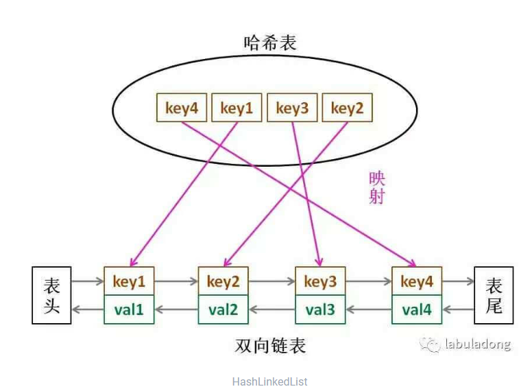

# 实现LRU

LRU 算法就是一种缓存淘汰策略

用LinkedHashMap作为底层数据接口

每次插入和获取时，都将数据放入链表末尾，末尾的数据表示最近使用，表头的数据表示最近最久未使用，是最优先淘汰的数据。

原文地址：https://labuladong.gitbook.io/algo/gao-pin-mian-shi-xi-lie/lru-suan-fa




注意点：

1、put数据时，判断是否超过最大。超过最大进行淘汰策略，将最新的放入末尾。

2、get数据后，需要将本地的数据放入末尾，表示最近使用。

3、remove淘汰时，淘汰掉表头的最近最久未使用的数据。cache.keySet().Itertor().next();


```java
class LRUCache {
    int cap;
    LinkedHashMap<Integer, Integer> cache = new LinkedHashMap<>();
    public LRUCache(int capacity) { 
        this.cap = capacity;
    }

    public int get(int key) {
        if (!cache.containsKey(key)) {
            return -1;
        }
        // 将 key 变为最近使用
        makeRecently(key);
        return cache.get(key);
    }

    public void put(int key, int val) {
        if (cache.containsKey(key)) {
            // 修改 key 的值
            cache.put(key, val);
            // 将 key 变为最近使用
            makeRecently(key);
            return;
        }

        if (cache.size() >= this.cap) {
            // 链表头部就是最久未使用的 key
            int oldestKey = cache.keySet().iterator().next();
            cache.remove(oldestKey);
        }
        // 将新的 key 添加链表尾部
        cache.put(key, val);
    }

    private void makeRecently(int key) {
        int val = cache.get(key);
        // 删除 key，重新插入到队尾
        cache.remove(key);
        cache.put(key, val);
    }
}
```


