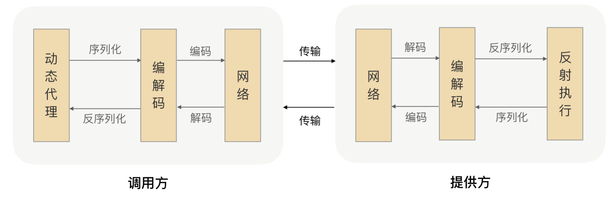

# 以往面经查看

## TreeSet & HashSet的区别

1、实现方式，HashSet 哈希表，TreeSet 红黑树

2、都不允许存相同的对象，这个相同由自己定义，HashSet通过重写对象的equail和hashcode方法，TreeSet通过类实现Comparable接口，获取将比较对象作为TreeSet的构造函数参数传入

3、HashSet数据无序，TreeSet有序，可使用LinkedHashSet 实现有序

4、存取数据时间复杂度不同，HashSet  O（1） TreeSet 自平衡的二叉树 O（logn）

## 多个线程等到某个节点，统一放行的方式

？？ 没太懂

考 join方法？

还是countLatch（减少）  cylicBarrier（增加）

## CAP了解吗？Redis中的CAP

Consistency (一致性)

Availability (可用性)

Partition Tolerance (分区容错性)

只能保证其中的两个，P必须保证，所以必须选择A or C


Redis的**单机版本**中，由于只有一个Master节点，所有客户端都是访问一个Master节点，不会出现数据不一致问题，保证了C**强一致性**，如果出现单点故障，那么Master节点直接挂掉，所有客户端都不可访问，那么就会不可用，牺牲了**A可用性**


Redis 集群Cluster，变成了分布式NoSQL数据库，CAP模型也从CP变成了AP。多个Master节点通过数据分片和数据冗余，Redis具有了真正的分布式能力，某个结点挂了的话，因为数据在其他结点上有备份，所以其他结点顶上来就可以继续提供服务，保证了**Availability**。但是如果某一个Master挂了，数据还没有同步，那么就会出现**数据不一致**。


## 如何理解幂等，项目中幂等如何做？

任意多次执行所产生的影响均与一次执行的影响相同，java中，通常指接口调用多次和调用一次所造成的影响是一样的。

在分布式系统中，可能由于网络问题造成重试操作，需要服务保证幂等。

### 实现幂等

前端：

对于有交互的方式，可以在前端过滤一部分，如防止表单重复提交，按钮置灰，隐藏，不可点击等方式。但是这对普通用户有效，不能阻止直接调用接口，实现多次调用。

后端：

**数据库唯一性校验**：使用数据库主键的唯一约束，在操作时传过来一个唯一id，插入时如果已经执行过那么肯定会报错，这个时候直接报错回滚就行，比较简单粗暴。

**状态机**：通常业务系统都会存在不同的状态，状态之间是有联系 或者先后关系的，可以通过状态字段来保证操作不会造成影响。比如单据审批状态，**更新状态时加上状态判断。**

**Token机制**：调用方在调用接口的时候先向后端请求一个全局ID（TOKEN），请求的时候携带这个全局ID一起请求，后端需要对这个全局ID校验来保证幂等操作。


## 反射能获取啥？能否获取参数名称、参数类型？

可以的

```java
// 获取所有声明的方法 包含受保护的
Method[] declaredMethods = OrgTest.class.getDeclaredMethods();
Method m = declaredMethods[1];
m.getParameterTypes //参数参数类型
m.getParameterCount()// 参数个数
m.getReturnType()// 返回类型
Parameter p
p.getName //获取参数名称
```

## 分布式锁主流实现方式

### Mysql

基于mysql实现，需要加锁时就插入一条记录，用到唯一性约束，其他线程再想获取锁时插入时会进行报错，这个时候就获取锁失败，可以进行重试，比如失败了重试多少次，之后就不去获取锁了。操作完成后就执行delete 删除记录，释放锁。

依赖于数据库性能，受到数据库性能的限制。插入数据，查询数据IO耗时，性能受到限制。

实例挂掉无法释放锁的场景，mysql数据无法设置过期时间，开一个后台线程去查看记录是否太久没用释放，自动释放锁。

通过增加一个字段存储获取锁的次数，增加一个字段存储获取当前锁线程的名称+机器号，实现可重入，释放一次就 减一。


也可以借助数据库的排他锁实现，for update，事务提交改为手动提交，提交事务后，自动释放锁。

### ZK

zk是一个分层的文件系统目录树结构，一个目录下只能有一个唯一文件名

加锁解锁步骤

1）创建一个目录mylock；
（2）线程A想获取锁就在mylock目录下创建临时顺序节点；
（3）获取mylock目录下所有的子节点，然后获取比自己小的兄弟节点，如果不存在，则说明当前线程顺序号最小，获得锁；
（4）线程B获取所有节点，判断自己不是最小节点，设置监听比自己次小的节点；
（5）线程A处理完，删除自己的节点，线程B监听到变更事件，判断自己是不是最小的节点，如果是则获得锁

使用Zk的开源 组件Curator，封装了很多命令简化操作，没用过。

### Redis

目前使用的最多的，场景简单的话，可以自己进行实现。

一般使用到SETNX （如果key不存在就设置，如果存在就设置失败返回0）、expire、delete命令实现。

我们是自己实现的redis分布式锁，使用threadlocal实现可重入性，ThreadLocal中存入 一个Map，保存key和重入次数。

加锁步骤

- 传入key，获取ThreadLocal变量，如果不为空，说明已经加锁，直接+1保存，可重入
- 如果不存在，则new 一个map set进去
- 获取redistemplate使用execute(RedisCallback<T> action)方法，传入一个自定义RedisCallback类，用于加锁
- 根据设置的锁超时时间，进行while循环，一直去尝试获取锁，如果失败则直接返回false不执行操作
- 使用watch命令监视传入的key，开启watch之后，如果key的值被修改，则事务失败，exec方法返回null，加锁失败，unwatch key，返回false
- 如果没有修改，则开启事务 设置key value，设置过期时间，提交事务，取消watch，然后返回ture
- 如果加锁成功，则将ThreadLocal中的map 变量的value +1

解锁步骤

- 根据传入的key 判断ThreadLocal中是否有值
- 如果是重入锁，解锁时减一 直接return，如果第一次解锁，则直接remove掉ThreadLocal中的值避免内存泄漏
- 调用redis del命令，删除传入的key 即可。


## ThreadLocal的作用是？说一下用法(https://mp.weixin.qq.com/s/8Ql-5kaUtxiCWyHR6uPPBw)

ThreadLocal 是线程局部变量，每个线程持有这个变量的一个副本，可以独立修改（set方法）和访问（get方法）这个变量，并且线程之间不会发生冲突。是一个轻量级的同步工具，可以实现各个线程变量的隔离。

原理：**每个线程的内部都维护了一个 ThreadLocalMap**，它是一个 Map（key,value）数据格式，key 是一个弱引用，也就是 ThreadLocal 本身，而 value 存的是线程变量的值。

```java
static class Entry extends WeakReference<ThreadLocal<?>> {
            /** The value associated with this ThreadLocal. */
            Object value;

            Entry(ThreadLocal<?> k, Object v) {
                super(k);
                value = v;
            }
        }
```

TheadLoaclMap 里面存储的是一个Entry 继承自弱引用，而key 使用了父类的方法，所以key是弱引用，而value是强引用。

ThreadLocal 本身并不存储线程的变量值，它只是一个工具，用来维护线程内部的 Map，帮助存和取变量，值是维护在自己Thread中，ThreadLocal帮助我们去设置以及取出。


ThreadLocalMap 中entry数组的扩容阈值与 2/3。

**entry下标使用的是key的hashcode 和entry数组长度 -1  进行 & 操作**

因为一个线程可以定义多个ThreadLocal对象，但是都存在同一个Thread中的ThreadLocalMap中，所以可能有hash冲突。

### ThreadLocal 的Hash冲突

nextIndex 方法寻找数据下标，在set时是找entry数组中的下标位置来存。

### ThreadLocal使用场景

1、存全局上下文信息，包括 租户、用户等,能够在任意地方都能取到

2、SimpleDateFormate

3、实现分布式锁 实现可重入性

4、Spring的事务管理器，使用ThreadLocal存Connection对象

### ThreadLocal为什么使用弱引用


https://www.cnblogs.com/-beyond/p/13125195.html

主要原因是使用弱引用方便key指向的threadLocal对象进行回收，key指向的对象为空，那么在下次对entry数组进行操作的时候，会自动对已经key==null（**key为null了， 但是value还是强应用**）的entry进行清除。

## Collections.sort 底层排序的方式？

Arrays.sort并不是单一的排序，而是插入排序，快速排序，归并排序三种排序的组合

根据阈值进行区分，采用不同的排序算法

简单的来说：

<47 : 插入排序

大于等于47 小于286 ：快速排序 （不稳定排序算法）

大于等于286  ： 归并排序 （稳定排序算法，复杂度O(nlogn)）

## 排序算法

### 快排


### 冒泡


## 排序算法的稳定性

指的是排序前后两个相等的数相对位置不变，则算法稳定。（如果存在多个关键字相同的数据）

**不稳定排序算法**

[堆排序](https://link.zhihu.com/?target=http%3A//baike.baidu.com/view/157305.htm)、[快速排序](https://link.zhihu.com/?target=http%3A//baike.baidu.com/view/115472.htm)、[希尔排序](https://link.zhihu.com/?target=http%3A//baike.baidu.com/view/178698.htm)、[直接选择排序](https://link.zhihu.com/?target=http%3A//baike.baidu.com/view/3632419.htm)

**稳定排序算法**

[基数排序](https://link.zhihu.com/?target=http%3A//baike.baidu.com/view/1170573.htm)、[冒泡排序](https://link.zhihu.com/?target=http%3A//baike.baidu.com/view/254413.htm)、[直接插入排序](https://link.zhihu.com/?target=http%3A//baike.baidu.com/view/1193395.htm)、[折半插入排序](https://link.zhihu.com/?target=http%3A//baike.baidu.com/view/9681546.htm)、[归并排序](https://link.zhihu.com/?target=http%3A//baike.baidu.com/view/90797.htm)

**稳定性的好处**

从一个键上排序，然后再从另一个键上排序，第一个键排序的结果可以为第二个键排序所用

## 两个有序的list，求交集

retainall？

stream流遍历，判断list1 是否包含当前元素，如果包含则collect.tolist


# 锁相关

## 悲观锁、乐观锁

悲观锁：就是每次都会假设存在竞争，所以每次操作时都会先加上锁，加了锁才能操作资源，操作完成后释放锁，加锁期间，别人无法进行操作。如java代码中的 synchronized、Lock，显示进行加锁，mysql的排他锁，for update 、 share in model等。

乐观锁：就是乐观的，认为每次并不一定会发生竞争，每次操作的时候只会判断一下是否和预期的一致，别人是否已经修改过了，如果没有则进行修改。比如常见的CAS，或者加版本号字段控制，都属于乐观锁。

**CAS常见的ABA问题，使用加版本号解决，每次操作version+1，就可以避免ABA问题。**


# JVM

## JVM判断对象是否回收

**引用计数法**：每个类使用一个计数器，每增加一个引用就+1。为0时则可以回收，但是会有无效引用、相互引用的问题

**可达性算法**：

这个算法的基本思想就是通过⼀系列的称为 **“GC Roots”** 的对象作为起点，从这些节点开始向下搜索，

节点所⾛过的路径称为引⽤链，当⼀个对象到 GC Roots 没有任何引⽤链相连的话，则证明此对象是不

可⽤的。

可作为GC Roots的对象

- 虚拟机栈（栈帧中的本地变量表）中引用的对象
- 方法区中的类静态属性引用的对象
- 方法区中常量引用的对象
- Thread - 活着的线程，所引用的对象

## 什么时候发生minor gc 和 full gc

 虚拟机在进行minorGC之前会判断老年代最大的可用连续空间是否大于新生代的所有对象总空间

  1、如果大于的话，直接执行minorGC

  2、如果小于，判断是否开启HandlerPromotionFailure，没有开启直接FullGC

  3、如果开启了HanlerPromotionFailure, JVM会判断老年代的最大连续内存空间是否大于历次晋升的大小，如果小于直接执行FullGC

  4、如果大于的话，执行minorGC

full gc

- **老年代空间不足**

   如果创建一个大对象，Eden区域当中放不下这个大对象，会直接保存在老年代当中，如果老年代空间也不足，就会触发Full GC。为了避免这种情况，最好就是不要创建太大的对象。

- **持久代空间不足**

   如果有持久代空间的话，系统当中需要加载的类，调用的方法很多，同时持久代当中没有足够的空间，就出触发一次Full GC

- **YGC出现promotion failure**

  promotion failure发生在Young GC, 如果Survivor区当中存活对象的年龄达到了设定值，会就将Survivor区当中的对象拷贝到老年代，如果老年代的空间不足，就会发生promotion failure， 接下去就会发生Full GC.

- **统计YGC发生时晋升到老年代的平均总大小大于老年代的空闲空间**

   在发生YGC是会判断，是否安全，这里的安全指的是，当前老年代空间可以容纳YGC晋升的对象的平均大小，如果不安全，就不会执行YGC,转而执行Full GC。

- **显示调用System.gc**


# Mysql 和 Redis 数据一致性

并发不高的情况下使用分布式锁变为串行，更新数据库更新缓存即可，强一致性

并发高的情况，先删除缓存，在更新数据库，使用延迟双删策略，数据最终一致性

先更新数据库，然后删除缓存，保证数据的最终一致性

使用mq消息队列，将需要删除的缓存id发到mq中，然后进行消费，避免删除缓存失败的情况。

订阅mysql 的binlog推送到 消息队列中消费，然后更新redis的数据。

注意缓存最好设置过期时间，这样最坏的情况就是在过期时间内获取到的数据不一致。


# 微服务相关（内推的哥们说的考察的多，熔断、限流、降级等）

## 什么是微服务

微服务的概念是相对于传统的单体服务而言，微服务化的核心就是将传统的一站式应用，根据不同的业务拆分成一个一个的服务，彻底地去耦合,每一个微服务提供单个业务功能的服务，每个微服务可以根据业务采取不同的语言，一个服务做一件事，从技术角度看就是一种小而独立的处理过程，类似进程概念，能够自行单独启动或销毁，拥有自己独立的数据库。拆分后系统更加的灵活，扩展项更强。但是服务的复杂度也随之上升。

## 分布式系统面临的问题

高可用问题，不同的服务总有不可用的时候，如何做好系统得高可用。

CAP问题

数据的一致性问题，保证数据的最终一致性

服务雪崩：在微服务调用链路上，某一个服务不可用，导致调用它的上游服务接连的阻塞，从而导致大面积服务不可用的情况，造成级联故障。

**造成服务雪崩的原因：**

流量激增，异常流量，导致系统负载升高（项目中的计算类服务，由于用户不断上传记录，导致不停调用计算服务，发送到mq，计算服务一直消费，导致CPU飙升，导致其他服务调用时发生阻塞，响应严重变慢）解决：联系运维加资源扩容，应对大量计算服务，之后进行资源隔离，将计算服务单独拆分，不要影响其他服务，加入mq限流，削峰，排队消费，数据校验去重，幂等操作，避免重复计算。

缓存穿透：不停请求的数据库，返回临时缓存值，避免大量访问数据库。

程序bug：修复bug，紧急发布上线

数据库瓶颈：sql优化，硬件升级


## 什么是熔断、什么是降级

https://www.cnblogs.com/dalianpai/p/14389421.html

服务熔断：类别电路的断路器，当某个服务的响应时间太长或者失败次数太多，会进行熔断，访问该服务的请求会直接快速失败，不会继续请求，避免发生请求一直阻塞，导致服务器资源被沾满的情况。

SpringCloud 采用Hystrix做熔断处理，使用注解@HystrixCommand。

当失败的调用到一定阈值，缺省是5秒内20次调用失败就会启动熔断机制。Hystrix熔断器打开后，所以的请求都会快速失败，当过了一定时间后默认5s，开关会处于半开状态，意味着会尝试放过部分请求检测服务是否恢复正常，如果正常那么就关闭断路器。

**Hystrix可以指定熔断后的兜底处理，返回自定义的处理方案。**

服务降级：

指的是系统中一般分为0级系统，最重要的，和1、2、3级的次要系统，在发生服务雪崩时，可以对部分服务进行降级处理，不访问次要服务，节省资源，保证主要系统的正常访问。

或者是下游服务不可用时，调用方直接调用本地的兜底策略进行降级，fastback

熔断属于服务降级的一种策略。

## 熔断、限流、降级的区别

熔断强调的是服务之间的调用能实现自我恢复的状态；

限流是从系统的流量入口考虑，从进入的流量上进行限制，达到保护系统的作用；

降级，是从系统内部的平级服务或者业务的维度考虑，流量大了，可以干掉一些，保护其他正常使用；
熔断是降级方式的一种；

降级又是限流的一种方式；

三者都是为了通过一定的方式去保护流量过大时，保护系统的手段。保护系统资源，保证服务能够正常响应

## 限流的策略

固定、滑动时间窗口限流：在指定的时间段、滑动窗口时间内，配置一个限流规则，请求数不能超过多少，超过了就直接拒绝。使用计数器进行累计，时间到了就清零。（无法应对突发流量）

令牌桶、漏桶限流算法：

1. 接口限制 t 秒内最大访问次数为 n，则每隔 t/n 秒会放一个 token 到桶中；
2. 桶中最多可以存放 b 个 token，如果 token 到达时令牌桶已经满了，那么这个 token 会被丢弃；
3. 接口请求会先从令牌桶中取 token，拿到 token 则处理接口请求，拿不到 token 则执行限流。
4. 不需要单独服务去存放token，在获取token时根据时间差算出需要放入多少个，一次性放入即可。

**或者根据热点数据预测，分发到下游系统中，实现预热通，增加放入token 的速率，增加放入的token数量等，应对突发流量？？**

支持一次性取多个令牌出来。

### 分布式限流

上面所讲的是单机限流，在集群部署中，一个服务部署在多个服务器中，对单机单个服务进行限流。

而分布式限流指的是提供**服务级的限流**，限制对微服务集群的访问频率，比如限制 A 调用方每分钟最多请求 1 万次“用户服务”，分布式限流既可以使用单机限流算法也可以使用分布式限流算法。

需要一个中心化存储，使用Redis计数器记录限流次数，判断是否限流。


### 分布式限流架构

gateway 网关层统一限流

通过部署限流服务，请求rpc接口判断是否进行限流

耦合到服务内部，使用切面编程实现限流（使用redis中心化存储技术器）


## 限流实现原理

### 固定窗口


### 滑动窗口

https://juejin.cn/post/6870396751178629127

## **Hystrix断路器**

微服务架构中，对服务间调用超时、故障进行容错、限流、降级、熔断处理。

对依赖服务调用时出现的延迟和失败进行控制和容错

在复杂的分布式系统中，阻止某一个依赖服务的故障在整个系统中蔓延，级联故障

提供fail-fast（快速失败）和快速恢复的支持

提供fallback优雅降级的支持 ，兜底策略

支持近实时的监控、报警及运维操作


## 分布式系统得好处及缺点

- 每个单独的服务足够小，能够专注于每一个领域，开发效率高
- 服务更加灵活，可以根据业务需要采用不同的语言和框架
- 开发迅速，部署简单，发布服务不会影响其他服务
- 扩展性更强，易于集成第三方框架或者技术
- 能够提高系统得高可用、高并发，提升系统得性能


- CAP问题，根据业务需要，选择高可用or强一致性
- 分布式系统引入的系统复杂度，引入的起它中间件，增加了系统复杂度
- 服务治理给运维带来压力，运维能力的挑战（引出了后来的devops）
- 服务监控更加重要，便于问题定位，日志分析、链路追踪、故障定位
- 数据一致性，分布式事务，复杂度提高
- 服务间的通行成本，重试机制，幂等保证，链路耗时等

## 服务注册中心 eureka or zookeeper

euruka 是**ap  高可用性 ** 部分节点挂掉不影响使用，还是可以提供服务，但是服务注册列表可能是未同步的旧信息。

zookeeper是 **cp  强一致性**  主节点挂掉后，选举过程中会停止对外服务，选择成功才进行服务，保证服务的强一致性

根据业务需要自行选择

Eureka自我保护机制，如果在15分钟内超过85%的节点都没有正常的心跳，那么Eureka就认为客户端与注册中心出现了网络故障，此时会出现以下几种情况：

1. Eureka不再从注册列表中移除因为长时间没收到心跳而应该过期的服务
2. Eureka仍然能够接受新服务的注册和查询请求，但是不会被同步到其它节点上(即保证当前节点依然可用)
3. 当网络稳定时，当前实例新的注册信息会被同步到其它节点中


## 分布式事务

单独列出

分布式事务.md


# 系统设计相关

要点：

1、场景：问清楚面试官那些场景，需要实现那些功能，用户量、预期QPS、预期流量等，不要一开始就进行设计。

2、服务：需要拆分为那些服务，每个服务是干什么的。即业务操作的整合。

3、存储：怎么进行存储，sql or nosql 数据库，性能考虑。

4、扩展：查漏补缺，对系统存在的缺陷进行补充说明，提出更好的扩展性设计。


## 设计一个LRU缓存系统

使用java自带的LinkedHashMap ，已经实现了LRU功能，需要自己加一个容量判断说明时候进行remove，需要重写removeEldestEntry方法，全部调用父类LinkedHashMap 的get 、put方法。

```java
class LRUCache extends LinkedHashMap<Integer, Integer>{
    private int capacity;
    
    public LRUCache(int capacity) {
        super(capacity, 0.75F, true);
        this.capacity = capacity;
    }

    public int get(int key) {
        return super.getOrDefault(key, -1);
    }

    public void put(int key, int value) {
        super.put(key, value);
    }

    @Override
    protected boolean removeEldestEntry(Map.Entry<Integer, Integer> eldest) {
        return size() > capacity; 
    }
}
```

自己实现一个双向链表

```java
public class LRUCache {
    class DLinkedNode {
        int key;
        int value;
        DLinkedNode prev;
        DLinkedNode next;
        public DLinkedNode() {}
        public DLinkedNode(int _key, int _value) {key = _key; value = _value;}
    }

    private Map<Integer, DLinkedNode> cache = new HashMap<Integer, DLinkedNode>();
    private int size;
    private int capacity;
    private DLinkedNode head, tail;

    public LRUCache(int capacity) {
        this.size = 0;
        this.capacity = capacity;
        // 使用伪头部和伪尾部节点
        head = new DLinkedNode();
        tail = new DLinkedNode();
        // 相连
        head.next = tail;
        tail.prev = head;
    }

    public int get(int key) {
        DLinkedNode node = cache.get(key);
        if (node == null) {
            return -1;
        }
        // 如果 key 存在，先通过哈希表定位，再移到头部
        moveToHead(node);
        return node.value;
    }

    public void put(int key, int value) {
        DLinkedNode node = cache.get(key);
        if (node == null) {
            // 如果 key 不存在，创建一个新的节点
            DLinkedNode newNode = new DLinkedNode(key, value);
            // 添加进哈希表
            cache.put(key, newNode);
            // 添加至双向链表的头部
            addToHead(newNode);
            ++size;
            if (size > capacity) {
                // 如果超出容量，删除双向链表的尾部节点
                DLinkedNode tail = removeTail();
                // 删除哈希表中对应的项
                cache.remove(tail.key);
                --size;
            }
        }
        else {
            // 如果 key 存在，先通过哈希表定位，再修改 value，并移到头部
            node.value = value;
            moveToHead(node);
        }
    }

    private void addToHead(DLinkedNode node) {
        node.prev = head;
        node.next = head.next;
        head.next.prev = node;
        head.next = node;
    }

    private void removeNode(DLinkedNode node) {
        node.prev.next = node.next;
        node.next.prev = node.prev;
    }

    private void moveToHead(DLinkedNode node) {
        removeNode(node);
        addToHead(node);
    }

    private DLinkedNode removeTail() {
        DLinkedNode res = tail.prev;
        removeNode(res);
        return res;
    }
}
```


## 设计一个RPC

RPC：远程过程调用，RPC使得程序能够像访问本地系统资源一样，去访问远端系统资源。


RPC一次完整过程的步骤：

1、服务寻址

服务提供方将ip、提供的服务等信息注册到注册中心 Eureka、Zookeeper


2、建立通信

服务调用者，去注册中心拿到目标服务的地址后，建立Tcp连接，发送一个请求，可以是http协议亦可以是dubbo协议，也可以自定义协议。


3、网络传输

建立通信后，需要将需要 调用的方法，参数等传递到目标服务，需要进行序列化操作，序列化为二进制流传递过去。

目标机器拿到后需要进行反序列化拿到正常的参数和方法，进行反射调用本地方法，拿到返回值，同样进行序列化响应给调用者。

传输一般RPC框架都采用的netty进行。

如果自己写可以先直接使用socket进行同步阻塞IO实现，效率比较低。使用netty同步非阻塞IO提高效率。

4、服务调用


