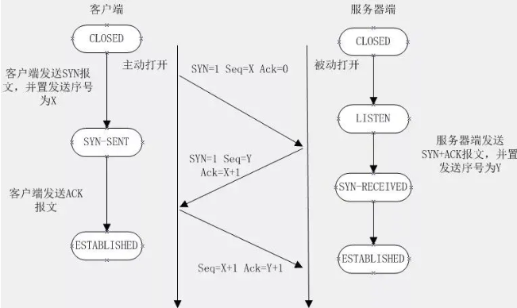
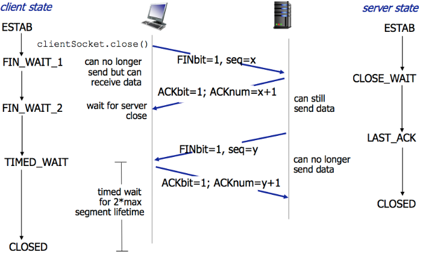

# 计算机网络面试题

https://mp.weixin.qq.com/s?__biz=Mzg3MDYwOTYzNQ==&mid=2247485122&idx=1&sn=3d17908025633bfc560598171fbe739e&source=41#wechat_redirect

## **TCP三次握手** 

建立一个 TCP 连接时，需要客户端和服务器总共发送3个包。

三次握手的目的是连接服务器指定端口，建立 TCP 连接，并同步连接双方的序列号和确认号，交换 TCP 窗口大小信息

示意图

步骤：

1、客户端发送一个 TCP 的 SYN 标志位置1的包，指明客户端打算连接的服务器的端口，以及初始序号 X,保存在包头的序列号(Sequence Number)字段里。发送完毕后，客户端进入 `SYN_SEND` 状态

2、服务器发回确认包(ACK)应答。即 SYN 标志位和 ACK 标志位均为1。服务器端选择自己 ISN 序列号，放到 Seq 域里，同时将确认序号(Acknowledgement Number)设置为客户的 ISN 加1，即X+1。 发送完毕后，服务器端进入 `SYN_RCVD` 状态

3、客户端再次发送确认包(ACK)，SYN 标志位为0，ACK 标志位为1，并且把服务器发来 ACK 的序号字段+1，放在确定字段中发送给对方，并且在数据段放写ISN的+1。发送完毕后，客户端进入 `ESTABLISHED` 状态，当服务器端接收到这个包时，也进入 `ESTABLISHED` 状态，TCP 握手结束

**三次握手才能确保服务端收到了客户端的消息，同时客户端也成功收到了服务的消息，形成完整的通信，形成一个闭环，少了一步都不能确认对方是否收到了消息。**

### TCP 四次挥手

1、假设客户端想要关闭连接，客户端发送一个 FIN 标志位置为1的包，表示自己已经没有数据可以发送了，但是仍然可以接受数据

2、服务器端确认客户端的 FIN 包，发送一个确认包，表明自己接受到了客户端关闭连接的请求，但还没有准备好关闭连接。发送完毕后，服务器端进入 `CLOSE_WAIT` 状态，客户端接收到这个确认包之后，进入 `FIN_WAIT_2` 状态，等待服务器端关闭连接

3、服务器端准备好关闭连接时，向客户端发送结束连接请求，FIN 置为1。发送完毕后，服务器端进入 `LAST_ACK` 状态，等待来自客户端的最后一个ACK。

4、客户端接收到来自服务器端的关闭请求，发送一个确认包，并进入 `TIME_WAIT`状态，等待可能出现的要求重传的 ACK 包。服务器端接收到这个确认包之后，关闭连接，进入 `CLOSED` 状态。

客户端等待了某个固定时间（两个最大段生命周期，2MSL，2 Maximum Segment Lifetime）之后，没有收到服务器端的 ACK ，认为服务器端已经正常关闭连接，于是自己也关闭连接，进入 `CLOSED` 状态

**四次挥手，确保服务端和客户端都已经向对方发送完毕数据，进入关闭状态。**

## 设计一个可靠传输的UDP

可以参考TCP（下面）来设计，根据业务需要去掉一些设计来保证快速。

## TCP为什么是可靠传输的

- 校验和：数据传输的过程中，将发送的数据段都当做一个16位的整数。将这些整数加起来。并且前面的进位不能丢弃，补在后面，最后取反，得到校验和。
- 序列号 ：每个数据包都有一个序列号，ack确认会传过去，确保数据收到
- 确认应答
- 超时重传：如果数据包丢了orack确认消息丢了，进行重传，如果已经收到了，那么再传一个ack，并丢弃到这个重复的包
- 连接管理
- 流量控制：滑动窗口，接受报文 的缓冲区，在进行连接ack时，会交换窗口的大小，动态调整
- 拥塞控制：慢启动，一开始慢慢传，探路网络状况，之后进行增加流量

### TCP包头的内容

- 端口：源端口号和目标端口号是不可少的，如果没有这两个端口号。数据就不知道应该发给哪个应用。
- 序号：接下来是包的序号。为什么要给包编号呢？当然是为了解决乱序的问题。不编好号怎么确认哪个应该先来，哪个应该后到呢。编号是为了解决乱序问题。既然是社会老司机，做事当然要稳重，一件件来，面临再复杂的情况，也临危不乱。
- 还应该有的就是确认序号。发出去的包应该有确认，要不然我怎么知道对方有没有收到呢？如果没有收到就应该重新发送，直到送达。这个可以解决不丢包的问题。作为老司机，做事当然要靠谱，答应了就要做到，暂时做不到也要有个回复。
- 状态位：接下来有一些状态位。例如 SYN 是发起一个连接，ACK 是回复，RST 是重新连接，FIN 是结束连接等。TCP 是面向连接的，因而双方要维护连接的状态，这些带状态位的包的发送，会引起双方的状态变更。
- 窗口大小：还有一个重要的就是窗口大小。TCP 要做流量控制，通信双方各声明一个窗口，标识自己当前能够的处理能力，别发送的太快，撑死我，也别发的太慢，饿死我

## HTTP请求头的内容

- url地址
- 请求方法类型
- 状态码
- 目标服务器地址
- 请求的语言、接受的语言类型
- 是否长连接
- 客户端类型
- 数据类型 content-type

## UDP包头

- 目标端口
- 源端口
- UDP长度
- 校验和
- 数据

## HTTP1.0 HTTP1.1 HTTP2.0 的区别

### 1.0 1.1区别

- 缓存处理
- Host头处理：1.0认为一个host对应一个ip地址，随着虚拟机技术发展，多个虚拟主机可以共享一个ip地址，1.1的请求消息和响应消息都应支持Host头域，且请求消息中如果没有Host头域会报告一个错误（400 Bad Request）。
- 长连接：1.1的连接默认是长连接，keep-alive = true

### 1.x 和 2.0区别

- 新的解析格式：1.x解析基于文本，2.0基于二进制
- 多路复用
- header压缩：减少发送信息大小

## 浏览器敲一个域名发生了什么

常见的问题

dns解析，http协议 - tcp协议- ip协议- mac地址-网关-网络传输-目标服务器-反向之前的操作-反向代理-服务器解析-响应-原路返回

随机应答就行

## Tcp如何保证靠谱

- 应用数据被分割成 TCP 认为最适合发送的数据块。
- TCP 给发送的每一个包进行编号，接收方对数据包进行排序，把有序数据传送给应用层。
- 校验和：TCP 将保持它首部和数据的检验和。这是一个端到端的检验和，目的是检测数据在传输过程中的任何变化。如果收到段的检验和有差错，TCP 将丢弃这个报文段和不确认收到此报文段。
- TCP 的接收端会丢弃重复的数据。（由于网络原因导致ack丢失而重发的数据）
- 流量控制：TCP 连接的每一方都有固定大小的缓冲空间，TCP的接收端只允许发送端发送接收端缓冲区能接纳的数据。当接收方来不及处理发送方的数据，能提示发送方降低发送的速率，防止包丢失。TCP 使用的流量控制协议是可变大小的滑动窗口协议。（TCP 利用滑动窗口实现流量控制）
- 拥塞控制：当网络拥塞时，减少数据的发送。（探路机制，一开始发慢点探测网络状态，慢慢加大发送量）
- ARQ协议：也是为了实现可靠传输的，它的基本原理就是每发完一个分组就停止发送，等待对方确认。在收到确认后再发下一个分组。
- 超时重传：当 TCP 发出一个段后，它启动一个定时器，等待目的端确认收到这个报文段。如果不能及时收到一个确认，将重发这个报文段。

## OSI七层模型

### 应用层

**HTTP FTP TFTP SMTP SNMP DNS TELNET HTTPS POP3 DHCP**

### 表示层

### 会话层

### 传输层

定义传输数据的协议端口号，以及流控和差错校验。

协议有：**TCP UDP，数据包一旦离开网卡即进入网络传输层**

### 网络层

进行逻辑地址寻址，实现不同网络之间的路径选择。

协议有：**ICMP IGMP IP（IPV4 IPV6）**

### 数据链路层

建立逻辑连接、进行硬件地址寻址、差错校验 [3] 等功能。

### 物理层

建立、维护、断开物理连接。

## Http 和 Https的区别

1、https协议需要到ca申请证书，一般免费证书较少，因而需要一定费用。

 2、http是超文本传输协议，信息是明文传输，https则是具有安全性的ssl加密传输协议。

 3、http和https使用的是完全不同的连接方式，用的端口也不一样，前者是80，后者是443。

 4、http的连接很简单，是无状态的；HTTPS协议是由SSL+HTTP协议构建的可进行加密传输、身份认证的网络协议，比http协议安全。

### Https工作原理

**1、客户端发起HTTPS请求**

 这个没什么好说的，就是用户在浏览器里输入一个https网址，然后连接到server的443端口。

**2、服务端的配置**

 采用HTTPS协议的服务器必须要有一套数字证书，可以自己制作，也可以向组织申请，区别就是自己颁发的证书需要客户端验证通过，才可以继续访问，而使用受信任的公司申请的证书则不会弹出提示页面(startssl就是个不错的选择，有1年的免费服务)。

 这套证书其实就是一对公钥和私钥，如果对公钥和私钥不太理解，可以想象成一把钥匙和一个锁头，只是全世界只有你一个人有这把钥匙，你可以把锁头给别人，别人可以用这个锁把重要的东西锁起来，然后发给你，因为只有你一个人有这把钥匙，所以只有你才能看到被这把锁锁起来的东西。

**3、传送证书**

 这个证书其实就是公钥，只是包含了很多信息，如证书的颁发机构，过期时间等等。

**4、客户端解析证书**

 这部分工作是有客户端的TLS来完成的，首先会验证公钥是否有效，比如颁发机构，过期时间等等，如果发现异常，则会弹出一个警告框，提示证书存在问题。

 如果证书没有问题，那么就生成一个随机值，然后用证书对该随机值进行加密，就好像上面说的，把随机值用锁头锁起来，这样除非有钥匙，不然看不到被锁住的内容。

**5、传送加密信息**

 这部分传送的是用证书加密后的随机值，目的就是让服务端得到这个随机值，以后客户端和服务端的通信就可以通过这个随机值来进行加密解密了。

**6、服务段解密信息**

 服务端用私钥解密后，得到了客户端传过来的随机值(私钥)，然后把内容通过该值进行对称加密，所谓对称加密就是，将信息和私钥通过某种算法混合在一起，这样除非知道私钥，不然无法获取内容，而正好客户端和服务端都知道这个私钥，所以只要加密算法够彪悍，私钥够复杂，数据就够安全。

**7、传输加密后的信息**

 这部分信息是服务段用私钥加密后的信息，可以在客户端被还原。

**8、客户端解密信息**

 客户端用之前生成的私钥解密服务段传过来的信息，于是获取了解密后的内容，整个过程第三方即使监听到了数据，也束手无策。

## Https加密

https://zhuanlan.zhihu.com/p/43789231

对称加密、非对称加密、数字证书、数字签名、CA机构

## Tcp拥塞控制

https://blog.csdn.net/qq_41431406/article/details/97926927

**拥塞**
计算机网络中的带宽、交换结点中的缓存和处理机等，都是网络的资源。在某段时间，若对网络中资源的需求超过了可用的资源，若网络中许多资源同时供应不足，网络的性能就会变坏，整个网络的吞吐量随之负荷的增大而下降。这种情况就叫做拥塞。

**TCP的四种拥塞控制算法**
1.慢开始
2.拥塞避免算法
3.快重传
4.快恢复

慢开始核心是：发送方维护一个拥塞窗口，一开始不知道网络情况，那么启用慢开始，发送少的报文去做探测，如果成功ack，那么认为没有出现网络拥塞，那么将拥塞窗口指数增加，直到达到阈值，那么采用线性方式进行增加。如果出现超时重传，那么就认为出现拥塞，那么开始进行满算法，将满算法阈值设置为原始的一般，窗口设置为1。

快重传&快恢复：认为不是发生了拥塞，而是出现了正常的报文丢失，要求发送发快速的发送报文，没有接收到ack就可以将下一个进行发送，如果接收方接收到了失序的报文，那么就立即进行ack（有序报文的ack），当发送方接收到累计3个的前序的ack时，那么认为报文丢失了，那么再传一次丢失的报文，而之前发送的报文可以存储在接收端。出现这种情况，不会直接启用慢开始算法，而是将满算法的阈值设置为一半，然后将拥塞窗口设置为阈值的一半（当前阈值的一半），然后采用线性增长的方式（+1）。

