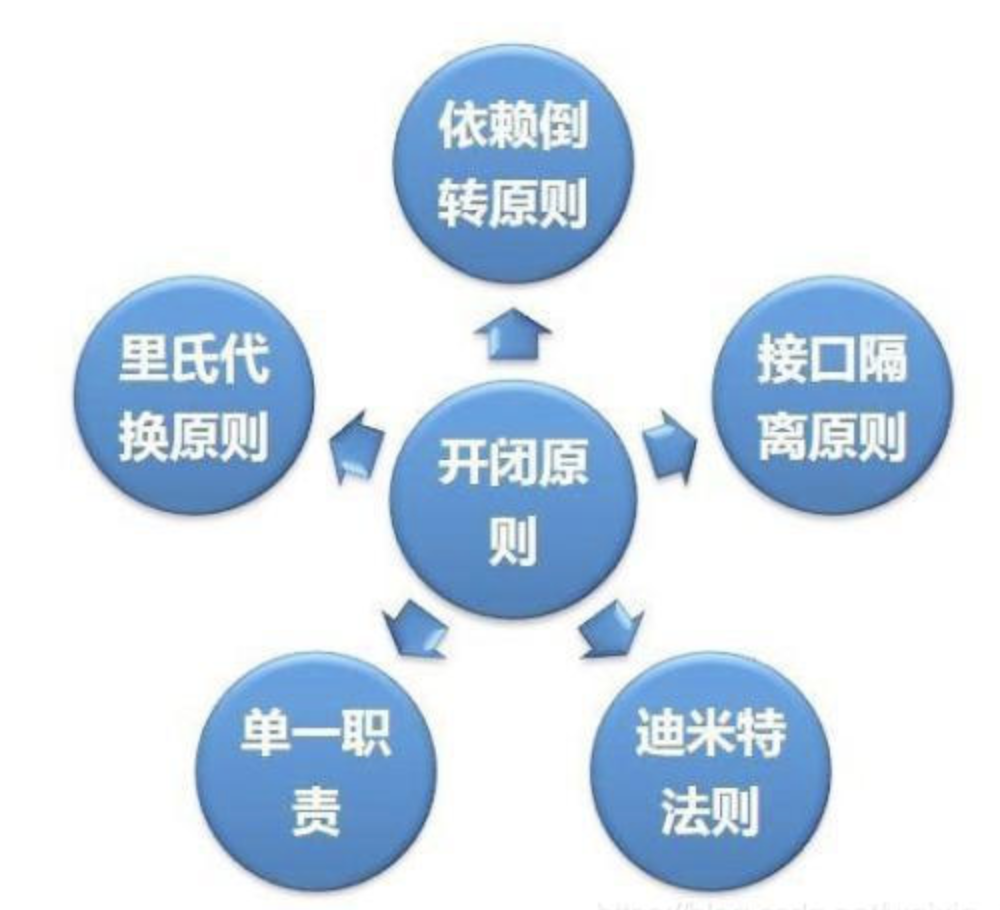

# 设计模式

https://www.cnblogs.com/crazymakercircle/p/14367101.html

- 创建型模式，共五种：**工厂方法模式、抽象工厂模式**、**单例模式**、建造者模式、**原型模式。**
- 结构型模式，共七种：适配器模式、装饰器模式、代理模式、外观模式、桥接模式、组合模式、享元模式。
- 行为型模式，共十一种：策略模式、模板方法模式、观察者模式、迭代子模式、责任链模式、命令模式、备忘录模式、状态模式、访问者模式、中介者模式、解释器模式。（根据行为采取不同的操作？）

## 设计模式六大原则



## 单例模式

- 保证一个类只有一个实例，并且提供一个访问该全局访问点


### 破坏单例模式

**1、反射通过构造函数在创建一个对象**

解决：

通过在构造函数中判断对象是否不为空，如果不为空，直接抛错

**2、序列化、反序列化后会新建一个对象**

在单例模式中写一个readResolve()方法，直接返回原始的单例对象

原理：当JVM从内存中反序列化地"组装"一个新对象时，就会自动调用这个 readResolve方法。

```java
privite Object readResolve(){
  return single;
}
```


### 静态内部类实现单例

```java

public class SingleTon{
  private SingleTon(){
    
  }

  private static class SingleTonHoler{
     private static SingleTon INSTANCE = new SingleTon();
 }
 
  public static SingleTon getInstance(){
    return SingleTonHoler.INSTANCE;
  }
}
```

### 枚举实现单例

```java
public class Demo4 {

    public static Demo4 getInstance() {
        return Demo.INSTANCE.getInstance();
    }

    public static void main(String[] args) {
        Demo4 s1 = Demo4.getInstance();
        Demo4 s2 = Demo4.getInstance();
        System.out.println(s1 == s2);
    }

  //定义枚举
	private static enum Demo {
		INSTANCE;
	// 枚举元素为单例
		private Demo4 demo4;

		private Demo() {
			System.out.println("枚举Demo私有构造参数");
			demo4 = new Demo4();
		}

		public Demo4 getInstance() {
			return demo4;
		}
	}
}
```

## 工厂模式

- 它提供了一种创建对象的最佳方式。在工厂模式中，我们在创建对象时不会对客户端暴露创建逻辑，并且是通过使用一个共同的接口来指向新创建的对象。实现了创建者和调用者分离，工厂模式分为简单工厂、工厂方法、抽象工厂模式

好处：

- 工厂模式是我们最常用的实例化对象模式了，是用工厂方法代替new操作的一种模式。
- 利用工厂模式可以降低程序的耦合性，为后期的维护修改提供了很大的便利。
- 将选择实现类、创建对象统一管理和控制。从而将调用者跟我们的实现类解耦。

### Spring中的工厂模式

**Spring IOC**

- 看过Spring源码就知道，在Spring IOC容器创建bean的过程是使用了工厂设计模式
- Spring中无论是通过xml配置还是通过配置类还是注解进行创建bean，大部分都是通过简单工厂来进行创建的。
- 当容器拿到了beanName和class类型后，动态的通过反射创建具体的某个对象，最后将创建的对象放到Map中

Spring IOC使用工厂的好处

- 在实际开发中，如果我们A对象调用B，B调用C，C调用D的话我们程序的耦合性就会变高。（耦合大致分为类与类之间的依赖，方法与方法之间的依赖。）
- 在很久以前的三层架构编程时，都是控制层调用业务层，业务层调用数据访问层时，都是是直接new对象，耦合性大大提升，代码重复量很高，对象满天飞
- 为了避免这种情况，Spring使用工厂模式编程，写一个工厂，由工厂创建Bean，以后我们如果要对象就直接管工厂要就可以，剩下的事情不归我们管了。Spring IOC容器的工厂中有个静态的Map集合，是为了让工厂符合单例设计模式，即每个对象只生产一次，生产出对象后就存入到Map集合中，保证了实例不会重复影响程序效率。

### 简单工厂

- 优点：简单工厂模式能够根据外界给定的信息，决定究竟应该创建哪个具体类的对象。明确区分了各自的职责和权力，有利于整个软件体系结构的优化。
- 缺点：很明显工厂类集中了所有实例的创建逻辑，容易违反GRASPR的高内聚的责任分配原则

```java
public class CarFactory {

	 public static Car createCar(String name) {
		if ("".equals(name)) {
             return null;
		}
		if(name.equals("奥迪")){
			return new AoDi();
		}
		if(name.equals("宝马")){
			return new Bmw();
		}
		return null;
	}
}

public class Client01 {

	public static void main(String[] args) {
		Car aodi  =CarFactory.createCar("奥迪");
		Car bmw  =CarFactory.createCar("宝马");
		aodi.run();
		bmw.run();
	}
}
```

### 工厂方法模式

将工厂作为一个接口，只给出需要具体工厂子类必须实现的接口，而不接触哪一个产品类应当被实例化这种细节。由具体的子类去实现去实现产品的细节。

```java
public interface CarFactory {

	Car createCar();

}

public class AoDiFactory implements CarFactory {

	public Car createCar() {
	
		return new AoDi();
	}
}

public class BmwFactory implements CarFactory {

	public Car createCar() {

		return new Bmw();
	}

}
public class Client {

	public static void main(String[] args) {
		Car aodi = new AoDiFactory().createCar();
		Car jili = new BmwFactory().createCar();
		aodi.run();
		jili.run();
	}
}
```


### 抽象工厂


## 代理模式

### 什么是代理模式

- 通过代理控制对象的访问，可以在这个对象调用方法之前、调用方法之后去处理/添加新的功能。(也就是AO的P微实现)
- 代理在原有代码乃至原业务流程都不修改的情况下，直接在业务流程中切入新代码，增加新功能，这也和Spring的（面向切面编程）很相似

### 静态代理

- 由程序员创建或工具生成代理类的源码，再编译代理类。所谓静态也就是在程序运行前就已经存在代理类的字节码文件，代理类和委托类的关系在运行前就确定了。

```java
//接口类
public class UserDao{
	public void save() {
		System.out.println("保存数据方法");
	}
}
//运行测试类
public  class Test{
	public static void main(String[] args) {
		UserDao userDao = new UserDao();
		userDao.save();
	}
}

//代理类
public class UserDaoProxy extends UserDao {
	private UserDao userDao;

	public UserDaoProxy(UserDao userDao) {
		this.userDao = userDao;
	}

	public void save() {
		System.out.println("开启事物...");
		userDao.save();
		System.out.println("关闭事物...");
	}
}

//添加完静态代理的测试类
public class Test{
	public static void main(String[] args) {
		UserDao userDao = new UserDao();
		UserDaoProxy userDaoProxy = new UserDaoProxy(userDao);
		userDaoProxy.save();
	}
}
```


### 动态代理

实现 InvocationHandler接口，重写invoke方法，对在方法执行前进行增强。

```java
// 每次生成动态代理类对象时,实现了InvocationHandler接口的调用处理器对象
public class InvocationHandlerImpl implements InvocationHandler {

	// 这其实业务实现类对象，用来调用具体的业务方法
    private Object target;

    // 通过构造函数传入目标对象
    public InvocationHandlerImpl(Object target) {
        this.target = target;
    }

    //动态代理实际运行的代理方法
    public Object invoke(Object proxy, Method method, Object[] args) throws Throwable {
        System.out.println("调用开始处理");
        //下面invoke()方法是以反射的方式来创建对象，第一个参数是要创建的对象，第二个是构成方法的参数，由第二个参数来决定创建对象使用哪个构造方法
		Object result = method.invoke(target, args);
        System.out.println("调用结束处理");
        return result;
    }
}

public class Test {
    public static void main(String[] args) {
        // 被代理对象
        UserDao userDaoImpl = new UserDaoImpl();
        InvocationHandlerImpl invocationHandlerImpl = new InvocationHandlerImpl(userDaoImpl);

        //类加载器
        ClassLoader loader = userDaoImpl.getClass().getClassLoader();
        Class<?>[] interfaces = userDaoImpl.getClass().getInterfaces();

        // 主要装载器、一组接口及调用处理动态代理实例
        UserDao newProxyInstance = (UserDao) Proxy.newProxyInstance(loader, interfaces, invocationHandlerImpl);
        newProxyInstance.save();
    }
}
```


## 建造者模式

### .什么是建造者模式

- 建造者模式：是将一个复杂的对象的构建与它的表示分离，使得同样的构建过程可以创建不同的方式进行创建。
- 工厂类模式是提供的是创建单个类的产品
- 而建造者模式则是将各种产品集中起来进行管理，用来具有不同的属性的产品


## 模板方法模式

### 1.什么是模板方法

- 模板方法模式：定义一个操作中的算法骨架（父类），而将一些步骤延迟到子类中。
  模板方法使得子类可以不改变一个算法的结构来重定义该算法的

### 2.什么时候使用模板方法

- 实现一些操作时，整体步骤很固定，但是呢。就是其中一小部分需要改变，这时候可以使用模板方法模式，将容易变的部分抽象出来，供子类实现。

类似一个操作中有固定的步骤，但是中间有一些方法，部分步骤是不同的，可以将这些方法进行抽象，交给子类来实现，而其他方法还是走父类的方法。


## 外观模式（门面模式）

### 1.什么是外观模式

- 外观模式：也叫门面模式，隐藏系统的复杂性，并向客户端提供了一个客户端可以访问系统的接口。
- 它向现有的系统添加一个接口，用这一个接口来隐藏实际的系统的复杂性。
- 使用外观模式，他外部看起来就是一个接口，其实他的内部有很多复杂的接口已经被实现

```java
public class Computer {
	AliSmsService aliSmsService;
	EamilSmsService eamilSmsService;
	WeiXinSmsService weiXinSmsService;

	public Computer() {
		aliSmsService = new AliSmsServiceImpl();
		eamilSmsService = new EamilSmsServiceImpl();
		weiXinSmsService = new WeiXinSmsServiceImpl();
	}

	//只需要调用它
	public void sendMsg() {
		aliSmsService.sendSms();
		eamilSmsService.sendSms();
		weiXinSmsService.sendSms();
	}
}

public class Client {

    public static void main(String[] args) {
        //普通模式需要这样
        AliSmsService aliSmsService = new AliSmsServiceImpl();
        EamilSmsService eamilSmsService = new EamilSmsServiceImpl();
        WeiXinSmsService weiXinSmsService = new WeiXinSmsServiceImpl();
        aliSmsService.sendSms();
        eamilSmsService.sendSms();
        weiXinSmsService.sendSms();

        //利用外观模式简化方法
        new Computer().sendMsg();
    }
}
```


## 策略模式

## 策略模式

### 1.什么是策略模式

对一个功能有多种实现方式，根据不同的操作配置参数等，对应不同的操作和实现。简化if else代码。

比如打折活动针对不同等级的会员有不同的策略操作

比如支付模块，有各种第三方支付，需要根据不同厂商进行不同的策略和操作

- 定义了一系列的算法 或 逻辑 或 相同意义的操作，并将每一个算法、逻辑、操作封装起来，而且使它们还可以相互替换。（其实策略模式Java中用的非常非常广泛）
- 我觉得主要是为了 简化 if…else 所带来的复杂和难以维护。


## 观察者模式

### 什么是观察者模式

- 先讲什么是行为性模型，行为型模式关注的是系统中对象之间的相互交互，解决系统在运行时对象之间的相互通信和协作，进一步明确对象的职责。
- 观察者模式，是一种行为性模型，又叫发布-订阅模式，他定义对象之间一种一对多的依赖关系，使得当一个对象改变状态，则所有依赖于它的对象都会得到通知并自动更新。

```java
```

